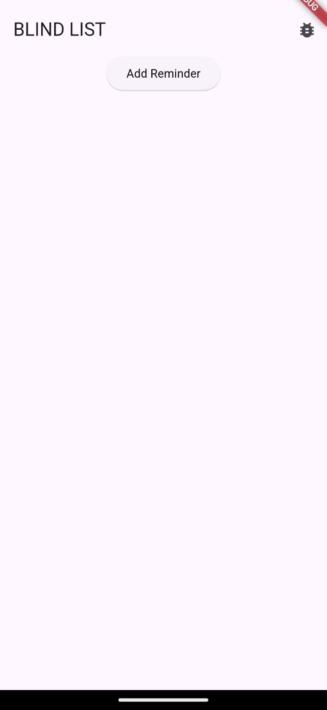
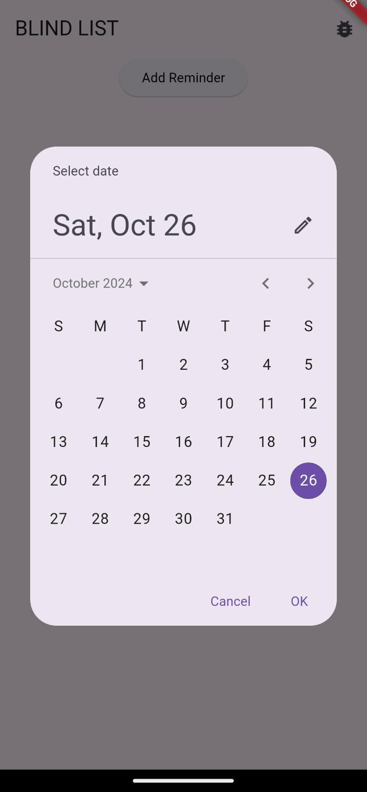
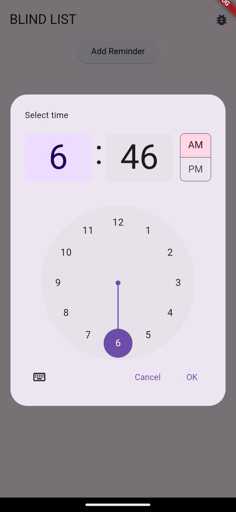
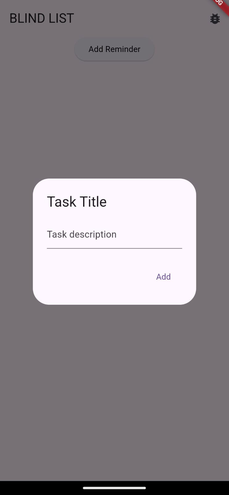
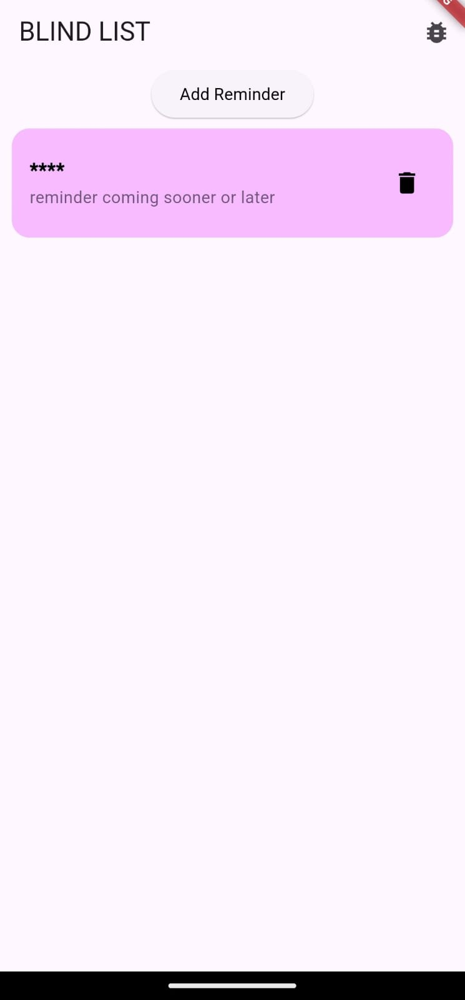

# totally-useless initial commit

# BlindList 🎯

## Basic Details
### Team Name: Void Main

### Team Members
- Team Lead: Jishnu Sursh - SCMS
- Member 2: Fathil P M - SCMS
- Member 3: Akshay Kumar M S - SCMS

### Project Description
BlindList: It’s like a to-do list, but you’re not allowed to know what’s on it. Finish random tasks, hope they’re the right ones, and maybe you'll accidentally get stuff done! 

### The Problem (that doesn't exist)
BlindList solves the devastating problem of knowing what you have to do. Why be burdened by the heavy knowledge of your own tasks? With BlindList, you can stumble into productivity without the pesky pressure of planning—because who doesn’t want a little mystery in their Monday?

### The Solution (that nobody asked for)
BlindList solves it by turning your to-do list into a covert operation! You jot down your tasks, and we lock them away like classified files. The only way to unlock them? Complete random activities until—bam!—one of them matches. It’s like productivity karaoke: you don’t know the words, but you’re singing anyway. By the time you’re done, you’ve been productive without even knowing what you set out to do!!

## Technical Details
### Technologies/Components Used
For Software:
- Languages used : Dart
- Frameworks used : Flutter
- Tools used : VS Code, Android Studio

### Implementation
For Software:
# Installation
1.**Download the APK File from the releases page**
2. **Install the APK on Your Android Device**

# Run
After installing the APK, you can launch the app:
Open Manually on the Device
1. Find the app icon on your device's home screen or app drawer.
2. Tap on it to open the app.

### Project Documentation
For Software:

# Screenshots
![Screenshot1]

![Screenshot2]

![Screenshot3]

![Screenshot4]

![Screenshot5]

# Diagrams

*Add caption explaining your workflow*

### Project Demo
# Video
[Watch the demo video](demo-assets/demo-video.mp4)
*Adding a reminder by using the add task button* after the task has been added after 5 seconds the task is revealed. The actual app is supposed to show it after 24 hours in which the date is set but for to easy understanding what the app is supposed to achieve its set to just show what it does after the 24 hours

## Team Contributions
- Jishnu: Implementation
- Fathil P M: Animation
- Akshay Kumar M S: Multiple Descriptions

---
Made with ❤️ at TinkerHub Useless Projects 

